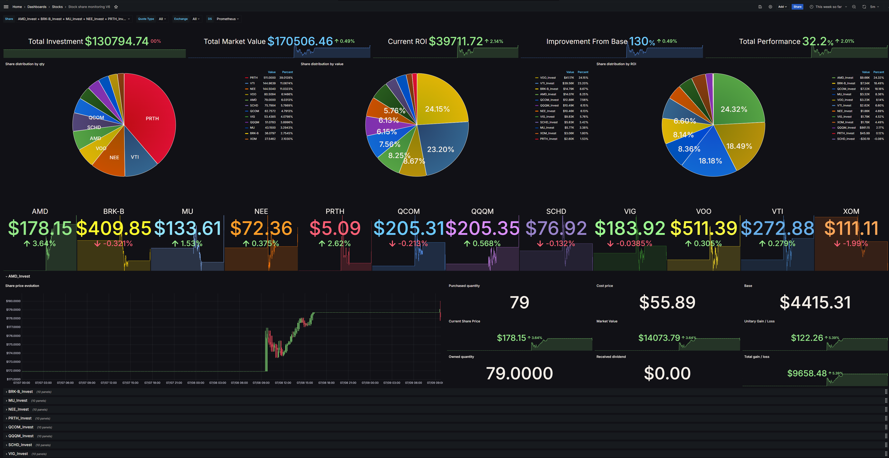

# Stock Share Monitoring

Small app written in Python to monitor the stock shares you own. It uses Prometheus as TSDB and Yfinance to scrape the price in realtime.  



## Using SuiviBourse

Please visit the [documentation's website](https://pbrissaud.github.io/suivi-bourse/docs) !

```bash
wget https://github.com/pbrissaud/suivi-bourse/archive/refs/tags/v3.7.2.tar.gz

mkdir  /usr/local/suivibourse

tar -xf *.tar.gz -C /usr/local/suivibourse

cd /usr/local/suivibourse

ls

cd suivi-bourse-*

ls

cd docker-compose/

ls

nano config.yaml 

docker compose up -d

```

## Getting Started

There are mutiple ways to run the app but **Docker Compose** is the easiest way to begin !

Note: Docker Compose launches a full environnement with a pre-configured Prometheus and Grafana 

### 1. Install Requirements
* Docker (>19.03.0)
* Docker-Compose 

### 2. Modify config
Edit the `config.yaml` file located in `docker-compose` folder. Complete the file with the provided example or visit the [chapter 3](https://pbrissaud.github.io/suivi-bourse/docs/intro/config) of the documentation to know more about writing config file. 

*Example Config:* 
```yaml
---
shares:
- name: Apple
  symbol: AAPL
  purchase:
    quantity: 1
    fee: 2
    cost_price: 119.98
  estate:
    quantity: 2
    received_dividend: 2.85
```

### 3. Run the stack
Run the following command in the `docker-compose` folder :

```bash
docker compose up -d
```

### 4. Visit Grafana
Connect to Grafana (`http://localhost:3000`) with the following credentials:
* login:  `admin`
* password: `admin`
    
and go to dashboard **Stock share monitoring**

*NB:* please wait ~10m to see all the cells getting filled

If you are not seeing data, good chance something is just slightly not happy, use the below to troubbleshoot. 

```bash
cd /usr/local/suivibourse/suivi-bourse-3.7.2/docker-compose

docker compose logs -f

...
suivi-bourse-app   | yaml.scanner.ScannerError: while scanning a simple key
suivi-bourse-app   |   in "/home/appuser/.config/SuiviBourse/config.yaml", line 166, column 3
suivi-bourse-app   | could not find expected ':'
suivi-bourse-app   |   in "/home/appuser/.config/SuiviBourse/config.yaml", line 167, column 3
...

...
suivi-bourse-app   | time=2024-07-06T02:40:27.998000 level=INFO location=main.py:152:<module> msg="SuiviBourse is running !" 
suivi-bourse-app   | time=2024-07-06T02:40:28.073000 level=CRITICAL location=main.py:180:<module> msg="Shares field of the config file is invalid :{'shares': [{16: [{'estate': [{'received_dividend': ['null value not allowed']}]}]}]}" 
suivi-bourse-app exited with code 1
suivi-bourse-app   | time=2024-07-06T02:40:36.126000 level=INFO location=main.py:152:<module> msg="SuiviBourse is running !" 
suivi-bourse-app   | time=2024-07-06T02:40:36.203000 level=CRITICAL location=main.py:180:<module> msg="Shares field of the config file is invalid :{'shares': [{16: [{'estate': [{'received_dividend': ['null value not allowed']}]}]}]}" 
suivi-bourse-app   | time=2024-07-06T02:40:50.659000 level=INFO location=main.py:152:<module> msg="SuiviBourse is running !" 
suivi-bourse-app   | time=2024-07-06T02:40:50.734000 level=CRITICAL location=main.py:180:<module> msg="Shares field of the config file is invalid :{'shares': [{16: [{'estate': [{'received_dividend': ['null value not allowed']}]}]}]}" 
...

```
